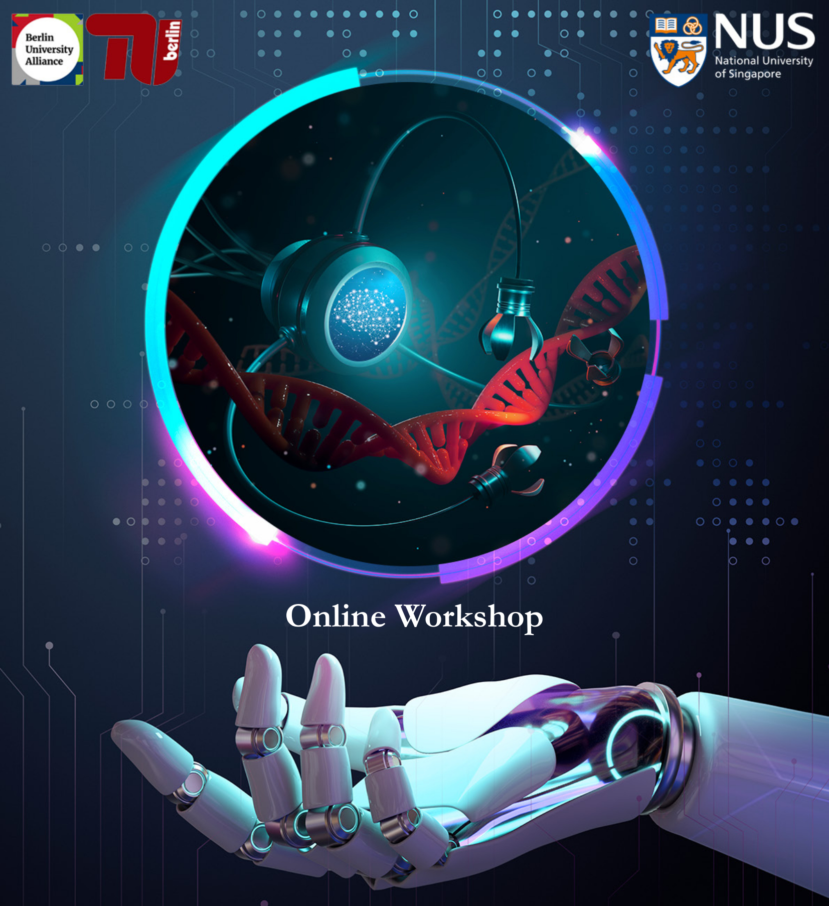

### Time: 6-9 a.m. (PDT), 2-5 p.m. (GMT), 3-6 p.m. (CET), 9-12 p.m. (SGT)

Accompanying the surge in applying artificial intelligence (AI) to robotic control, robotics facilitated by AI is reforming our society, from Tesla’s fully self-driving system to Boston Dynamics’s multi-tasking robotic dog. Its demonstrated prowess inspires us to develop AI-powered motion control and path planning for real-time, robust, and intelligent manipulation of swimming microrobots. This informal workshop will focus on the recent progress made in this emerging interdisciplinary field─designing micro-swimmers based on artificial intelligence, connecting researchers with expertise in soft matter physics, robotics, machine learning, fluid mechanics and applied mathematics.

### Invited Speakers

[Antonio Celani](https://www.ictp.it/phonebook/person?id=2439), The Abdus Salam International Centre for Theoretical Physics, Italy 
[Andreas Zöttl](https://scholar.google.co.uk/citations?user=CYRGC9AAAAAJ&hl=en), Universität Wien, Austria 
[Benno Liebchen](https://www.physik.tu-darmstadt.de/fbphysik/professoren/mitarbeiterdetails_de_en_professoren_67200.en.jsp), Technische Universität Darmstadt, Germany 
[Frank Cichos](https://home.uni-leipzig.de/~physik/sites/mona/), Universität Leipzig, Germany 
[Metin Sitti](https://www.is.mpg.de/~sitti), Max Planck Institute for Intelligent Systems, Germany 
[On Shun Pak](https://www.scu.edu/engineering/faculty/pak-on-shun/), Santa Clara University, USA
### Schedule

### Organizers

[Lailai Zhu](http://lailaiflow.com), [National University of Singapore (NUS)](https://www.nus.edu.sg) 
[Holger Stark](https://www.itp.tu-berlin.de/stark/ag_stark/members/prof_dr_holger_stark/), [Technische Universität Berlin](https://www.tu.berlin/en/) as a partner of [Berlin University Alliance (BUA)](https://www.berlin-university-alliance.de/en/index.html)

### Acknowledgement
We thank the support from the BUA-NUS Strategic Research Partnership.
